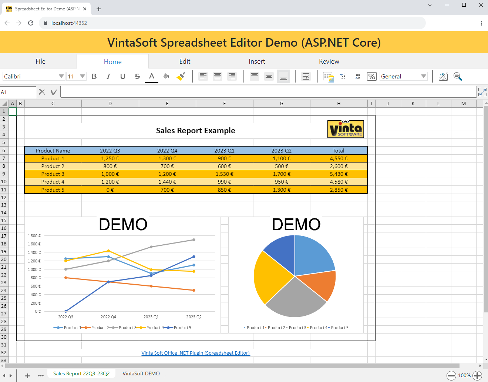

# VintaSoft ASP.NET Core Spreadsheet Editor Demo

This ASP.NET Core project uses <a href="https://www.vintasoft.com/vsimaging-dotnet-index.html">VintaSoft Imaging .NET SDK</a>.
The client-side of project uses HTML+JavaScript+CSS. The server-side of project uses ASP.NET Core API controllers.<br />
<br />
The project demonstrates how to view and edit XLSX document in ASP.NET Core:
* Create a new or open an existing XLSX, XLS, CSV or TSV document in spreadsheet editor control
* Work with worksheets of spreadsheet document
  * Get a list of worksheets
  * Add/delete/rename a worksheet; copy/insert a worksheet; reorder worksheets
* Work with worksheet of spreadsheet document
  * Render a worksheet
  * Navigate by cells using mouse and keyboard
  * Insert or delete columns/rows
  * Change size of columns/rows
  * Show/hide columns/rows
  * Search and replace text
* Work with selected cells of worksheet
  * Select cells using mouse and keyboard
  * Insert, copy, paste and delete selected cells
  * Change style properties (font, fill, borders, number format, text style, alignment, indent, etc) of selected cells
  * Change size of selected cells
  * Auto-fit column width or row height of selected cells
  * Clear styles, content, hyperlinks of selected cells
  * Merge and unmerge selected cells
  * Show and hide selected cells
* Work with cell of worksheet
  * Display formatted and localized text of cell
  * Calculate formula of cell
  * Edit cell text directly in cell region
  * Edit cell text in formula bar
  * Highlight references while editing a cell formula
* Work with Drawing (Charts, Pictures, Graphics)
  * Render drawings on worksheet
  * Update a chart if chart data has changed
  * Select a drawing on worksheet
  * Add drawing to a worksheet
  * Delete drawing from worksheet
* Work with comments
  * Render comments on worksheet
  * Add, edit, delete a comment
* The application can be used in any modern HTML5 web browser.
* The application UI is localized into 45 languages (Afrikaans, Arabic, Armenian, Azerbaijan, Belarusian, Bulgarian, Chinese, Croatian, Czech, Danish, Dutch, English, Estonian, Finnish, French, Georgian, German, Greece, Hebrew, Hindi, Hungarian, Italian, Japanese, Kazakh, Korean, Kyrgyz, Latvian, Lithuanian, Norwegian, Portugese, Romanian, Russian, Slovakian, Slovenian, Spanish, Swahili, Swedish, Tajik, Tatar, Turkish, Turkmen, Ukrainian, Uzbek, Vietnamese, Zulu).


## Screenshot



## Usage
1. Get the 30 day free evaluation license for <a href="https://www.vintasoft.com/vsimaging-dotnet-index.html" target="_blank">VintaSoft Imaging .NET SDK</a> as described here: <a href="https://www.vintasoft.com/docs/vsimaging-dotnet/Licensing-Evaluation.html" target="_blank">https://www.vintasoft.com/docs/vsimaging-dotnet/Licensing-Evaluation.html</a>

2. Update the evaluation license in "src\Startup.cs" file:
   ```
   Vintasoft.Imaging.ImagingGlobalSettings.Register("REG_USER", "REG_EMAIL", "EXPIRATION_DATE", "REG_CODE");
   ```

3. Build the project ("AspNetCoreSpreadsheetEditorDemo.Net8.csproj" file) in Visual Studio or using .NET CLI:
   ```
   dotnet build AspNetCoreSpreadsheetEditorDemo.Net8.csproj
   ```

4. Run compiled application and try to view and edit XLSX document.


## Documentation
VintaSoft Imaging .NET SDK on-line User Guide and API Reference for .NET developer is available here: https://www.vintasoft.com/docs/vsimaging-dotnet/


## Support
Please visit our <a href="https://myaccount.vintasoft.com/">online support center</a> if you have any question or problem.
